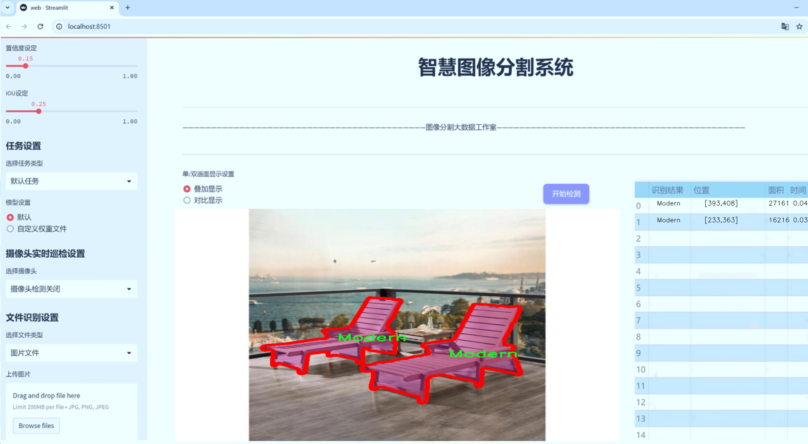
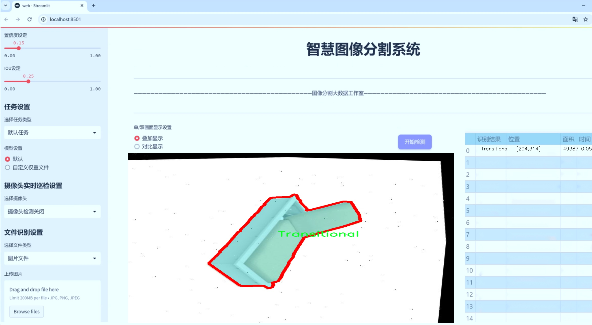
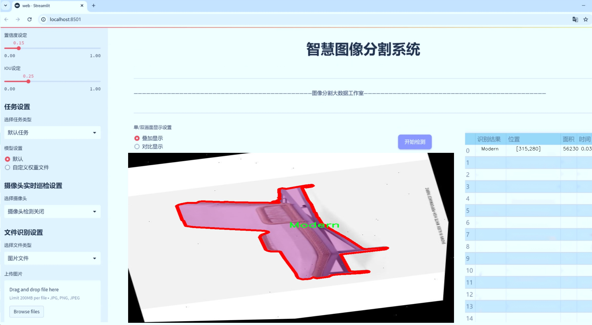
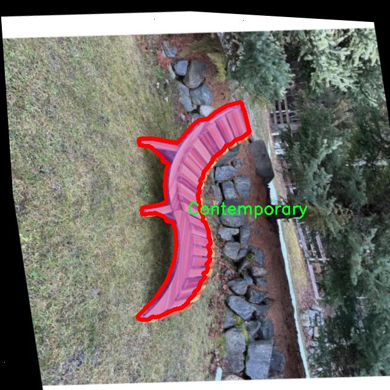
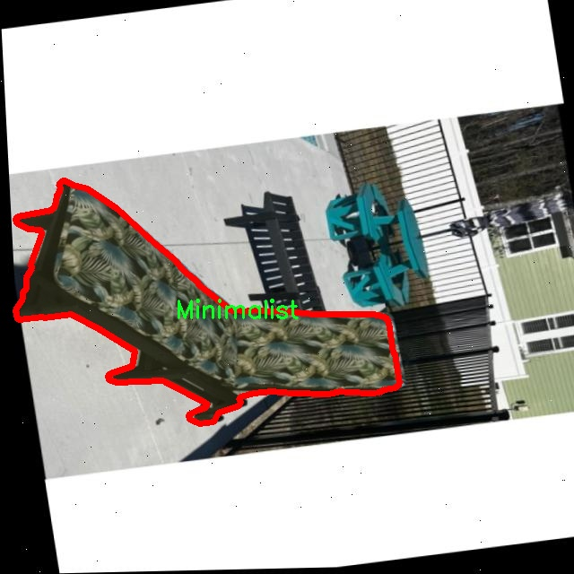
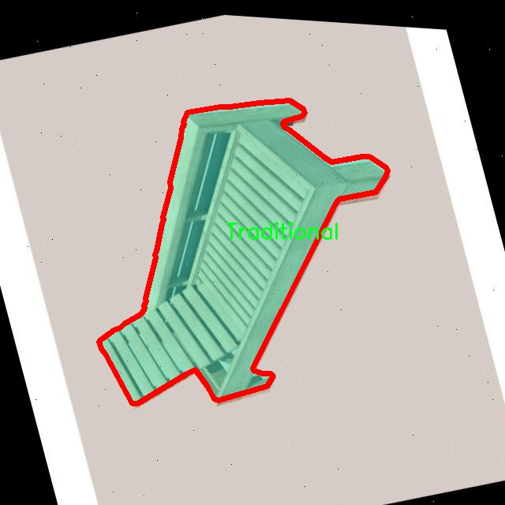
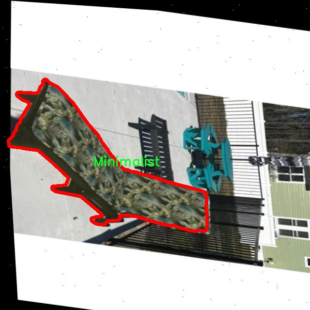
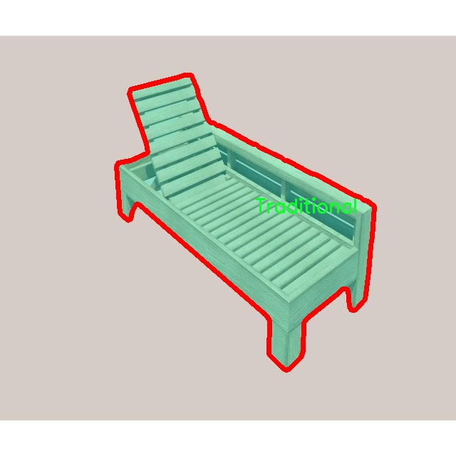

# 户外家具图像分割系统源码＆数据集分享
 [yolov8-seg-bifpn＆yolov8-seg-C2f-ODConv等50+全套改进创新点发刊_一键训练教程_Web前端展示]

### 1.研究背景与意义

项目参考[ILSVRC ImageNet Large Scale Visual Recognition Challenge](https://gitee.com/YOLOv8_YOLOv11_Segmentation_Studio/projects)

项目来源[AAAI Global Al lnnovation Contest](https://kdocs.cn/l/cszuIiCKVNis)

研究背景与意义

随着城市化进程的加快和人们生活水平的提高，户外家具的需求日益增长。户外家具不仅提升了居住环境的美观性，还为人们提供了舒适的休闲空间。与此同时，户外家具的种类繁多，包括烧烤架、椅子、沙发、桌子等多种形式，这使得其在设计、生产和销售过程中面临着诸多挑战。为了满足市场需求，相关企业亟需高效的图像处理技术，以便在产品设计、质量控制和市场推广等环节中提升效率和准确性。因此，基于改进YOLOv8的户外家具图像分割系统的研究具有重要的现实意义。

YOLO（You Only Look Once）系列模型作为一种高效的目标检测算法，近年来在计算机视觉领域取得了显著的进展。YOLOv8作为该系列的最新版本，具备了更高的检测精度和更快的处理速度，尤其适合于实时图像处理任务。然而，传统的YOLO模型在处理复杂场景中的实例分割任务时，仍然存在一定的局限性。为此，针对户外家具图像的特点，改进YOLOv8模型以实现更为精准的实例分割，能够有效提升户外家具的识别和分类能力。

本研究所使用的数据集包含5800张户外家具图像，涵盖了18个不同的类别，包括烧烤架、椅子、沙发、桌子等。这些图像不仅数量庞大，而且类别多样，能够为模型的训练提供丰富的样本。这种多样性使得模型在实际应用中具备更强的泛化能力，能够适应不同的环境和光照条件。通过对这些图像进行深入分析和处理，研究者可以更好地理解户外家具的特征，从而为后续的模型改进提供理论支持。

此外，图像分割技术在户外家具的应用中，不仅可以提高产品识别的准确性，还能够为智能家居、虚拟现实等领域提供重要的数据支持。在智能家居系统中，准确的家具识别与分割能够实现更为智能的环境交互；在虚拟现实中，真实的家具模型可以为用户提供更为沉浸的体验。因此，基于改进YOLOv8的户外家具图像分割系统的研究，不仅有助于推动计算机视觉技术的发展，还能够为相关产业的转型升级提供技术支持。

综上所述，基于改进YOLOv8的户外家具图像分割系统的研究，具有重要的理论价值和实际意义。通过深入探讨户外家具的图像特征，改进现有的图像分割算法，能够为相关领域提供更为高效、准确的解决方案，推动智能化、数字化的进程。未来的研究将继续探索更为先进的算法与技术，以期在户外家具的图像处理领域取得更大的突破。

### 2.图片演示







##### 注意：由于此博客编辑较早，上面“2.图片演示”和“3.视频演示”展示的系统图片或者视频可能为老版本，新版本在老版本的基础上升级如下：（实际效果以升级的新版本为准）

  （1）适配了YOLOV8的“目标检测”模型和“实例分割”模型，通过加载相应的权重（.pt）文件即可自适应加载模型。

  （2）支持“图片识别”、“视频识别”、“摄像头实时识别”三种识别模式。

  （3）支持“图片识别”、“视频识别”、“摄像头实时识别”三种识别结果保存导出，解决手动导出（容易卡顿出现爆内存）存在的问题，识别完自动保存结果并导出到tempDir中。

  （4）支持Web前端系统中的标题、背景图等自定义修改，后面提供修改教程。

  另外本项目提供训练的数据集和训练教程,暂不提供权重文件（best.pt）,需要您按照教程进行训练后实现图片演示和Web前端界面演示的效果。

### 3.视频演示

[3.1 视频演示](https://www.bilibili.com/video/BV1gr2oYNEbY/)

### 4.数据集信息展示

##### 4.1 本项目数据集详细数据（类别数＆类别名）

nc: 18
names: ['BBQ', 'Chair', 'Coastal', 'Contemporary', 'Fireplace', 'Industrial', 'Lamps', 'LoungerChaise', 'Minimalist', 'Modern', 'Rustic', 'Swimming_Pool', 'Table', 'Traditional', 'Transitional', 'Umbrella', 'sink', 'television']


##### 4.2 本项目数据集信息介绍

数据集信息展示

在本研究中，我们采用了名为“uretseg”的数据集，以训练和改进YOLOv8-seg模型，旨在实现高效的户外家具图像分割系统。该数据集包含18个类别，涵盖了多种户外家具及相关物品，具体类别包括：BBQ、Chair、Coastal、Contemporary、Fireplace、Industrial、Lamps、LoungerChaise、Minimalist、Modern、Rustic、Swimming_Pool、Table、Traditional、Transitional、Umbrella、sink以及television。这些类别的选择不仅反映了现代户外生活的多样性，也为图像分割任务提供了丰富的场景和物体特征。

“uretseg”数据集的构建过程注重于真实场景的采集，确保所收集的图像能够真实反映户外家具的多样性和复杂性。每个类别的图像均经过精心挑选，涵盖了不同的环境条件、光照变化以及视角差异，以增强模型的泛化能力。例如，BBQ类别的图像可能包括在阳光明媚的户外聚会中使用的烧烤架，而Chair类别则可能展示多种风格的户外椅子，如现代、传统和工业风格的设计。这种多样性使得模型在训练过程中能够学习到更为细致的特征，从而在实际应用中表现出更高的准确性和鲁棒性。

此外，数据集中的每个类别都配有详细的标注信息，这些标注不仅包括物体的边界框，还涵盖了物体的分割掩码。这种精细的标注方式为YOLOv8-seg模型提供了必要的训练数据，使其能够在进行图像分割时，不仅识别出物体的位置，还能准确区分物体的形状和轮廓。这对于户外家具的图像分割任务尤为重要，因为这些物体往往具有复杂的几何形状和丰富的纹理特征。

在数据集的使用过程中，我们还考虑到了数据增强技术的应用，以进一步提升模型的性能。通过对原始图像进行旋转、缩放、裁剪和颜色调整等操作，我们能够生成更多的训练样本，从而增强模型对不同场景和条件的适应能力。这种数据增强策略与“uretseg”数据集的多样性相结合，使得训练出的YOLOv8-seg模型在实际应用中能够更加准确地进行户外家具的图像分割。

综上所述，“uretseg”数据集为改进YOLOv8-seg的户外家具图像分割系统提供了丰富的素材和强大的支持。通过对18个类别的细致标注和多样化的图像采集，我们能够有效地训练出一个高效的图像分割模型，满足实际应用中对户外家具识别和分割的需求。这一数据集不仅为研究者提供了宝贵的资源，也为未来的相关研究奠定了坚实的基础。











### 5.全套项目环境部署视频教程（零基础手把手教学）

[5.1 环境部署教程链接（零基础手把手教学）](https://www.bilibili.com/video/BV1jG4Ve4E9t/?vd_source=bc9aec86d164b67a7004b996143742dc)


[5.2 安装Python虚拟环境创建和依赖库安装视频教程链接（零基础手把手教学）](https://www.bilibili.com/video/BV1nA4VeYEze/?vd_source=bc9aec86d164b67a7004b996143742dc)

### 6.手把手YOLOV8-seg训练视频教程（零基础小白有手就能学会）

[6.1 手把手YOLOV8-seg训练视频教程（零基础小白有手就能学会）](https://www.bilibili.com/video/BV1cA4VeYETe/?vd_source=bc9aec86d164b67a7004b996143742dc)


按照上面的训练视频教程链接加载项目提供的数据集，运行train.py即可开始训练



     Epoch   gpu_mem       box       obj       cls    labels  img_size
     1/200     0G   0.01576   0.01955  0.007536        22      1280: 100%|██████████| 849/849 [14:42<00:00,  1.04s/it]
               Class     Images     Labels          P          R     mAP@.5 mAP@.5:.95: 100%|██████████| 213/213 [01:14<00:00,  2.87it/s]
                 all       3395      17314      0.994      0.957      0.0957      0.0843

     Epoch   gpu_mem       box       obj       cls    labels  img_size
     2/200     0G   0.01578   0.01923  0.007006        22      1280: 100%|██████████| 849/849 [14:44<00:00,  1.04s/it]
               Class     Images     Labels          P          R     mAP@.5 mAP@.5:.95: 100%|██████████| 213/213 [01:12<00:00,  2.95it/s]
                 all       3395      17314      0.996      0.956      0.0957      0.0845

     Epoch   gpu_mem       box       obj       cls    labels  img_size
     3/200     0G   0.01561    0.0191  0.006895        27      1280: 100%|██████████| 849/849 [10:56<00:00,  1.29it/s]
               Class     Images     Labels          P          R     mAP@.5 mAP@.5:.95: 100%|███████   | 187/213 [00:52<00:00,  4.04it/s]
                 all       3395      17314      0.996      0.957      0.0957      0.0845


### 7.50+种全套YOLOV8-seg创新点代码加载调参视频教程（一键加载写好的改进模型的配置文件）

[7.1 50+种全套YOLOV8-seg创新点代码加载调参视频教程（一键加载写好的改进模型的配置文件）](https://www.bilibili.com/video/BV1Hw4VePEXv/?vd_source=bc9aec86d164b67a7004b996143742dc)

### 8.YOLOV8-seg图像分割算法原理

原始YOLOv8-seg算法原理

YOLOv8-seg算法是2023年1月由Ultralytics推出的最新一代目标检测与实例分割模型，标志着YOLO系列在计算机视觉领域的又一次重要突破。YOLOv8不仅在检测精度和速度上超越了前代模型，还通过创新的网络结构和高效的训练策略，推动了实时目标检测技术的发展。该算法结合了YOLOv5、YOLOv6、YOLOv7及PP-YOLOE等多种先进设计理念，形成了一个集成化的、性能卓越的检测框架。

YOLOv8的网络结构可以分为四个主要部分：输入端、骨干网络、颈部网络和头部网络。输入端通过马赛克数据增强、自适应锚框计算和自适应灰度填充等技术，为后续的特征提取和目标检测提供了丰富的训练数据。骨干网络采用了新型的C2f模块，该模块通过引入更多的跳层连接和分支结构，增强了特征学习的能力，形成了更为复杂和强大的特征表示。C2f模块的设计灵感来源于YOLOv7的ELAN结构，能够有效地提升梯度流动性，从而使得模型在训练过程中能够更好地捕捉到目标的特征信息。

颈部网络采用了路径聚合网络（PAN）结构，这一设计极大地增强了网络对不同尺度目标的特征融合能力。PAN结构通过对特征图的上下文信息进行聚合，使得模型在处理小目标和大目标时都能保持较高的检测精度。头部网络则是YOLOv8的核心创新之一，它将传统的耦合头结构改为解耦头结构，分别处理分类和回归任务。这一改变不仅提高了模型的灵活性，还使得目标检测的效率得到了显著提升。

在损失函数的设计上，YOLOv8引入了Task-Aligned Assigner策略，基于分类与回归的分数加权结果来选择正样本。这一策略使得模型在训练过程中能够更有效地分配样本，提高了正负样本的区分度。损失计算涵盖了分类和回归两个分支，其中分类分支采用了二元交叉熵损失（BCELoss），而回归分支则结合了分布焦点损失（DFLoss）和完全交并比损失函数（CIOULoss），进一步提升了模型对边界框预测的精准性。

YOLOv8-seg的创新还体现在其无锚框检测头的设计上。传统的锚框方法在处理目标时往往需要大量的先验框，这不仅增加了计算复杂度，还可能导致检测精度的下降。YOLOv8通过引入Anchor-Free的检测头，显著减少了锚框的预测数量，简化了后续的非最大抑制（NMS）过程，从而加速了检测速度。这一设计使得YOLOv8在实时性和精度之间达到了良好的平衡，适用于各种复杂的应用场景。

在应用层面，YOLOv8-seg展现出了极高的灵活性和适应性，能够处理从目标检测到实例分割的多种任务。其高效的特征提取能力和精确的边界框预测，使得YOLOv8在农业、安防、交通监控等领域的应用前景广阔。例如，在苹果采摘的应用中，YOLOv8能够快速识别和定位果实，为自动采摘机器人提供实时的决策支持。结合蚁群算法进行路径规划，进一步提升了自动采摘的效率，使得农业生产更加智能化和自动化。

综上所述，YOLOv8-seg算法的原理不仅体现在其创新的网络结构和高效的训练策略上，更在于其在实际应用中的广泛适用性和优越性能。通过不断优化和改进，YOLOv8-seg为目标检测与实例分割领域带来了新的冲击，成为了当前计算机视觉技术中的一颗璀璨明珠。随着技术的不断进步，YOLOv8的应用场景将更加丰富，其潜力也将得到进一步挖掘，为未来的智能化发展提供强有力的支持。


### 9.系统功能展示（检测对象为举例，实际内容以本项目数据集为准）

图9.1.系统支持检测结果表格显示

  图9.2.系统支持置信度和IOU阈值手动调节

  图9.3.系统支持自定义加载权重文件best.pt(需要你通过步骤5中训练获得)

  图9.4.系统支持摄像头实时识别

  图9.5.系统支持图片识别

  图9.6.系统支持视频识别

  图9.7.系统支持识别结果文件自动保存

  图9.8.系统支持Excel导出检测结果数据


### 10.50+种全套YOLOV8-seg创新点原理讲解（非科班也可以轻松写刊发刊，V11版本正在科研待更新）

#### 10.1 由于篇幅限制，每个创新点的具体原理讲解就不一一展开，具体见下列网址中的创新点对应子项目的技术原理博客网址【Blog】：


[10.1 50+种全套YOLOV8-seg创新点原理讲解链接](https://gitee.com/qunmasj/good)

#### 10.2 部分改进模块原理讲解(完整的改进原理见上图和技术博客链接)【如果此小节的图加载失败可以通过CSDN或者Github搜索该博客的标题访问原始博客，原始博客图片显示正常】

### YOLOv8简介
继YOLOv5之后,Ultralytics公司在2023年1月发布了YOLOv8,该版本可以用于执行目标检测、实例分割和图像分类任务。整个网络结构由4部分组成:输入图像, Backbone主干网络获得图像的特征图, Head检测头预测目标对象和位置, Neck融合不同层的特征并将图像特征传递到预测层。
1)相比于YOLOv5和 YOLOv7算法,YOLOv8在训练时间和检测精度上得到极大提升,而且模型的权重文件只有6 MB,可以部署到任一嵌入式设备中,它凭借自身快速、高效的性能可以很好地满足实时检测的需求。
2)由于YOLOv8算法是YOLOv5的继承版本，对应提供了N、S、 M、L、X 等不同尺度的模型,用于满足不同场景的需求,在精度得到大幅提升的同时,能流畅地训练,并且能安装在各种硬件平台上运行。
3)在输入端,YOLOv8算法使用了Mosaic数据增强[15]、自适应锚框计算[16]等方法。Mosaic数据增强是通过随机缩放、随机裁剪、随机排布的方式进行拼接,丰富检测数据集。自适应锚框计算是网络在初始锚框的基础上输出预测框,通过差值计算、反向更新等操作计算出最佳锚框值。
4)在输出端,YOLOv8算法使用解耦头替换了以往的耦合头,将分类和回归解耦为两个独立的分支,通过解耦使各个任务更加专注,从而解决复杂场景下定位不准及分类错误的问题。


### OREPA：在线卷积重参数化
卷积神经网络(CNNs)已经在许多计算机视觉任务的应用成功，包括图像分类、目标检测、语义分割等。精度和模型效率之间的权衡也已被广泛讨论。

一般来说，一个精度较高的模型通常需要一个更复杂的块，一个更宽或更深的结构。然而，这样的模型总是太重，无法部署，特别是在硬件性能有限、需要实时推理的场景下。考虑到效率，更小、更紧凑和更快的模型自然是首选。

为了获得一个部署友好且高精度的模型，有研究者提出了基于结构重参数化的方法来释放性能。在这些方法中，模型在训练阶段和推理阶段有不同的结构。具体来说，使用复杂的训练阶段拓扑，即重参数化的块，来提高性能。训练结束后，通过等效变换将一个复杂的块重参为成一个单一的线性层。重参后的模型通常具有一个整洁架构模型，例如，通常是一个类似VGG的或一个类似ResNet的结构。从这个角度来看，重参化策略可以在不引入额外的推理时间成本的情况下提高模型的性能。


BN层是重构模型的关键组成部分。在一个重新解析块(图1(b))中，在每个卷积层之后立即添加一个BN层。可以观察到，去除这些BN层会导致的性能退化。然而，当考虑到效率时，这种BN层的使用出乎意料地在训练阶段带来了巨大的计算开销。在推理阶段，复杂的块可以被压缩成一个卷积层。但是，在训练过程中，BN层是非线性的，也就是说，它们将特征映射除以它的标准差，这就阻止了合并整个块。因此，存在大量的中间计算操作(large FLOPS)和缓冲特征映射(high memory usage)。更糟糕的是，这么高的训练预算使得很难探索更复杂和可能更强的重参块。很自然地，下面的问题就出现了：

为什么标准化在重参中这么重要？

通过分析和实验，作者认为BN层中的尺度因子最重要，因为它们能够使不同分支的优化方向多样化。

基于观察结果，作者提出了在线重参化(OREPA)(图1(c))，这是一个两阶段的pipeline，使之能够简化复杂的training-time re-param block。

在第一阶段，block linearization，去除所有的非线性BN层，并引入线性缩放层。这些层与BN层具有相似的性质，因此它们使不同分支的优化多样化。此外，这些层都是线性的，可以在训练过程中合并成卷积层。

第二阶段，block squeezing，将复杂的线性块简化为单一的卷积层。OREPA通过减少由中间计算层引起的计算和存储开销，显著降低了训练成本，对性能只有非常小的影响。

此外，高效化使得探索更复杂的重参化拓扑成为可能。为了验证这一点，作者进一步提出了几个重参化的组件，以获得更好的性能。

在ImageNet分类任务上评估了所提出的OREPA。与最先进的修复模型相比，OREPA将额外的训练时间GPU内存成本降低了65%到75%，并将训练过程加快了1.5-2.3倍。同时，OREPA-ResNet和OREPA-VGG的性能始终优于+0.2%∼+0.6%之前的DBB和RepVGG方法。同时作者还评估了在下游任务上的OREPA，即目标检测和语义分割。作者发现OREPA可以在这些任务上也可以带来性能的提高。

提出了在线卷积重参化(OREPA)策略，这极大地提高了重参化模型的训练效率，并使探索更强的重参化块成为可能；

通过对重参化模型工作机制的分析，用引入的线性尺度层代替BN层，这仍然提供了不同的优化方向，并保持了表示能力;

在各种视觉任务上的实验表明，OREPA在准确性和训练效率方面都优于以前的重参化模型(DBB/RepVGG)。


#### 结构重参化
结构重参化最近被重视并应用于许多计算机视觉任务，如紧凑模型设计、架构搜索和剪枝。重参化意味着不同的架构可以通过参数的等价转换来相互转换。例如，1×1卷积的一个分支和3×3卷积的一个分支，可以转移到3×3卷积的单个分支中。在训练阶段，设计了多分支和多层拓扑来取代普通的线性层(如conv或全连接层)来增强模型。Cao等讨论了如何在训练过程中合并深度可分离卷积核。然后在推理过程中，将训练时间的复杂模型转移到简单模型中，以便于更快的推理。

在受益于复杂的training-time拓扑，同时，当前的重参化方法训练使用不可忽略的额外计算成本。当块变得更复杂以变得更强的表示时，GPU内存利用率和训练时间将会越来越长，最终走向不可接受。与以往的重参化方法不同，本文更多地关注训练成本。提出了一种通用的在线卷积重参化策略，使training-time的结构重参化成为可能。


#### Normalization
BN被提出来缓解训练非常深度神经网络时的梯度消失问题。人们认为BN层是非常重要的，因为它们平滑了损失。最近关于无BN神经网络的研究声称，BN层并不是不可或缺的。通过良好的初始化和适当的正则化，可以优雅地去除BN层。

对于重参化模型，作者认为重参化块中的BN层是关键的。无BN的变体将会出现性能下降。然而，BN层是非线性的，也就是说，它们将特征图除以它的标准差，这阻止了在线合并块。为了使在线重参化可行，作者去掉了重参块中的所有BN层，并引入了BN层的线性替代方法，即线性缩放层。

#### 卷积分解
标准卷积层计算比较密集，导致大的FLOPs和参数量。因此，卷积分解方法被提出，并广泛应用于移动设备的轻量化模型中。重参化方法也可以看作是卷积分解的某种形式，但它更倾向于更复杂的拓扑结构。本文的方法的不同之处在于，在kernel-level上分解卷积，而不是在structure level。

#### 在线重参化
在本节中，首先，分析了关键组件，即重参化模型中的BN层，在此基础上提出了在线重参化(OREPA)，旨在大大减少再参数化模型的训练时间预算。OREPA能够将复杂的训练时间块简化为一个卷积层，并保持了较高的精度。

OREPA的整体pipeline如图所示，它包括一个Block Linearization阶段和一个Block Squeezing阶段。


参考该博客通过分析多层和多分支结构的优化多样性，深入研究了重参化的有效性，并证明了所提出的线性缩放层和BN层具有相似的效果。

最后，随着训练预算的减少，进一步探索了更多的组件，以实现更强的重参化模型，成本略有增加。

#### 重参化中的Normalization
作者认为中间BN层是重参化过程中多层和多分支结构的关键组成部分。以SoTA模型DBB和RepVGG为例，去除这些层会导致严重的性能下降，如表1所示。


这种观察结果也得到了Ding等人的实验支持。因此，作者认为中间的BN层对于重参化模型的性能是必不可少的。

然而，中间BN层的使用带来了更高的训练预算。作者注意到，在推理阶段，重参化块中的所有中间操作都是线性的，因此可以合并成一个卷积层，从而形成一个简单的结构。

但在训练过程中，BN层是非线性的，即它们将特征映射除以其标准差。因此，中间操作应该单独计算，这将导致更高的计算和内存成本。更糟糕的是，如此高的成本将阻止探索更强大的训练模块。

#### Block Linearization
如3.1中所述，中间的BN层阻止了在训练过程中合并单独的层。然而，由于性能问题，直接删除它们并不简单。为了解决这一困境，作者引入了channel级线性尺度操作作为BN的线性替代方法。

缩放层包含一个可学习的向量，它在通道维度中缩放特征映射。线性缩放层具有与BN层相似的效果，它们都促进多分支向不同的方向进行优化，这是重参化时性能提高的关键。除了对性能的影响外，线性缩放层还可以在训练过程中进行合并，使在线重参化成为可能。


基于线性缩放层，作者修改了重参化块，如图所示。具体来说，块的线性化阶段由以下3个步骤组成：

首先，删除了所有的非线性层，即重参化块中的BN层

其次，为了保持优化的多样性，在每个分支的末尾添加了一个缩放层，这是BN的线性替代方法

最后，为了稳定训练过程，在所有分支的添加后添加一个BN层。

一旦完成线性化阶段，在重参化块中只存在线性层，这意味着可以在训练阶段合并块中的所有组件。

#### Block Squeezing
Block Squeezing步骤将计算和内存昂贵的中间特征映射上的操作转换为更经济的kernel上的操作。这意味着在计算和内存方面从减少到，其中、是特征图和卷积核的空间尺寸。

一般来说，无论线性重参化块是多么复杂，以下2个属性始终成立：

Block中的所有线性层，例如深度卷积、平均池化和所提出的线性缩放，都可以用带有相应参数的退化卷积层来表示;

Block可以由一系列并行分支表示，每个分支由一系列卷积层组成。

有了上述两个特性，如果可以将

多层（即顺序结构）

多分支（即并行结构）

简化为单一卷积，就可以压缩一个块。在下面的部分中，将展示如何简化顺序结构(图(a))和并行结构(图(b))。


### 11.项目核心源码讲解（再也不用担心看不懂代码逻辑）

#### 11.1 ultralytics\models\sam\amg.py

以下是对给定代码的核心部分进行分析和详细注释的结果。代码主要涉及图像处理、边界框计算和掩膜稳定性评分等功能。

```python
import math
from itertools import product
from typing import Any, Generator, List, Tuple
import numpy as np
import torch

def is_box_near_crop_edge(boxes: torch.Tensor,
                          crop_box: List[int],
                          orig_box: List[int],
                          atol: float = 20.0) -> torch.Tensor:
    """
    判断给定的边界框是否接近裁剪边缘。

    参数:
    boxes: 需要检查的边界框，格式为 (x1, y1, x2, y2) 的张量。
    crop_box: 当前裁剪区域的边界框。
    orig_box: 原始图像的边界框。
    atol: 允许的绝对误差，默认为20.0。

    返回:
    返回一个布尔张量，指示哪些边界框接近裁剪边缘。
    """
    crop_box_torch = torch.as_tensor(crop_box, dtype=torch.float, device=boxes.device)
    orig_box_torch = torch.as_tensor(orig_box, dtype=torch.float, device=boxes.device)
    boxes = uncrop_boxes_xyxy(boxes, crop_box).float()  # 将裁剪框内的边界框转换为原始坐标
    near_crop_edge = torch.isclose(boxes, crop_box_torch[None, :], atol=atol, rtol=0)  # 检查是否接近裁剪边缘
    near_image_edge = torch.isclose(boxes, orig_box_torch[None, :], atol=atol, rtol=0)  # 检查是否接近原始图像边缘
    near_crop_edge = torch.logical_and(near_crop_edge, ~near_image_edge)  # 只保留接近裁剪边缘而不接近原始边缘的框
    return torch.any(near_crop_edge, dim=1)  # 返回是否有框接近裁剪边缘

def calculate_stability_score(masks: torch.Tensor, mask_threshold: float, threshold_offset: float) -> torch.Tensor:
    """
    计算一批掩膜的稳定性评分。

    稳定性评分是通过对掩膜进行阈值处理得到的二进制掩膜之间的交并比（IoU）。

    参数:
    masks: 掩膜张量。
    mask_threshold: 掩膜的阈值。
    threshold_offset: 阈值偏移量。

    返回:
    返回稳定性评分的张量。
    """
    intersections = ((masks > (mask_threshold + threshold_offset)).sum(-1, dtype=torch.int16).sum(-1, dtype=torch.int32))
    unions = ((masks > (mask_threshold - threshold_offset)).sum(-1, dtype=torch.int16).sum(-1, dtype=torch.int32))
    return intersections / unions  # 返回交并比

def generate_crop_boxes(im_size: Tuple[int, ...], n_layers: int, overlap_ratio: float) -> Tuple[List[List[int]], List[int]]:
    """
    生成不同大小的裁剪框列表。

    每一层有 (2**i)**2 个框。

    参数:
    im_size: 图像的尺寸 (高度, 宽度)。
    n_layers: 裁剪层数。
    overlap_ratio: 重叠比例。

    返回:
    返回裁剪框和对应的层索引。
    """
    crop_boxes, layer_idxs = [], []
    im_h, im_w = im_size
    short_side = min(im_h, im_w)

    # 添加原始图像的裁剪框
    crop_boxes.append([0, 0, im_w, im_h])
    layer_idxs.append(0)

    def crop_len(orig_len, n_crops, overlap):
        """计算裁剪框的长度。"""
        return int(math.ceil((overlap * (n_crops - 1) + orig_len) / n_crops))

    for i_layer in range(n_layers):
        n_crops_per_side = 2 ** (i_layer + 1)  # 每层的裁剪框数量
        overlap = int(overlap_ratio * short_side * (2 / n_crops_per_side))  # 计算重叠长度

        crop_w = crop_len(im_w, n_crops_per_side, overlap)  # 计算裁剪框宽度
        crop_h = crop_len(im_h, n_crops_per_side, overlap)  # 计算裁剪框高度

        crop_box_x0 = [int((crop_w - overlap) * i) for i in range(n_crops_per_side)]
        crop_box_y0 = [int((crop_h - overlap) * i) for i in range(n_crops_per_side)]

        # 生成裁剪框
        for x0, y0 in product(crop_box_x0, crop_box_y0):
            box = [x0, y0, min(x0 + crop_w, im_w), min(y0 + crop_h, im_h)]
            crop_boxes.append(box)
            layer_idxs.append(i_layer + 1)

    return crop_boxes, layer_idxs  # 返回所有裁剪框和层索引

def batched_mask_to_box(masks: torch.Tensor) -> torch.Tensor:
    """
    计算掩膜周围的边界框，格式为 XYXY。

    对于空掩膜返回 [0,0,0,0]。输入形状为 C1xC2x...xHxW，输出形状为 C1xC2x...x4。

    参数:
    masks: 掩膜张量。

    返回:
    返回边界框的张量。
    """
    if torch.numel(masks) == 0:  # 如果掩膜为空
        return torch.zeros(*masks.shape[:-2], 4, device=masks.device)

    shape = masks.shape
    h, w = shape[-2:]  # 获取掩膜的高度和宽度
    masks = masks.flatten(0, -3) if len(shape) > 2 else masks.unsqueeze(0)  # 规范化形状为 CxHxW

    # 获取边界框的上下边缘
    in_height, _ = torch.max(masks, dim=-1)
    in_height_coords = in_height * torch.arange(h, device=in_height.device)[None, :]
    bottom_edges, _ = torch.max(in_height_coords, dim=-1)
    in_height_coords = in_height_coords + h * (~in_height)
    top_edges, _ = torch.min(in_height_coords, dim=-1)

    # 获取边界框的左右边缘
    in_width, _ = torch.max(masks, dim=-2)
    in_width_coords = in_width * torch.arange(w, device=in_width.device)[None, :]
    right_edges, _ = torch.max(in_width_coords, dim=-1)
    in_width_coords = in_width_coords + w * (~in_width)
    left_edges, _ = torch.min(in_width_coords, dim=-1)

    # 处理空掩膜的情况
    empty_filter = (right_edges < left_edges) | (bottom_edges < top_edges)
    out = torch.stack([left_edges, top_edges, right_edges, bottom_edges], dim=-1)
    out = out * (~empty_filter).unsqueeze(-1)  # 将空掩膜的边界框设为 [0, 0, 0, 0]

    return out.reshape(*shape[:-2], 4) if len(shape) > 2 else out[0]  # 返回到原始形状
```

### 代码核心部分分析
1. **边界框与裁剪边缘的判断**：`is_box_near_crop_edge` 函数用于判断边界框是否接近裁剪区域的边缘，确保在图像处理时不会丢失重要信息。
  
2. **稳定性评分计算**：`calculate_stability_score` 函数通过计算掩膜的交并比来评估掩膜的稳定性，这在图像分割任务中非常重要。

3. **裁剪框生成**：`generate_crop_boxes` 函数根据图像尺寸和重叠比例生成不同大小的裁剪框，适用于多尺度的图像处理。

4. **掩膜到边界框的转换**：`batched_mask_to_box` 函数将掩膜转换为边界框，便于后续的目标检测和定位任务。

这些核心功能为图像处理和目标检测提供了基础，确保了模型能够有效地处理不同尺寸和比例的图像数据。

这个文件是Ultralytics YOLO项目中的一个模块，主要涉及图像处理和掩膜（mask）操作，特别是在目标检测和分割任务中使用的各种函数。文件中使用了PyTorch和NumPy库，提供了一系列用于处理图像、生成裁剪框、计算稳定性分数等功能的函数。

首先，文件定义了一个`is_box_near_crop_edge`函数，该函数用于判断给定的边界框是否接近裁剪框的边缘。它通过将边界框坐标与裁剪框和原始框进行比较，返回一个布尔张量，指示哪些边界框接近裁剪边缘。

接下来，`batch_iterator`函数用于从输入参数中生成批次数据。它确保所有输入参数的长度相同，并按指定的批次大小返回数据。

`calculate_stability_score`函数计算一组掩膜的稳定性分数，具体通过对掩膜进行阈值处理，计算其交并比（IoU）来实现。这对于评估掩膜的质量非常重要。

`build_point_grid`和`build_all_layer_point_grids`函数用于生成均匀分布的二维点网格，后者为不同层次生成点网格，通常用于图像分割中的采样。

`generate_crop_boxes`函数生成不同大小的裁剪框，支持重叠设置。它根据图像尺寸和层数生成裁剪框的坐标，适用于多尺度处理。

`uncrop_boxes_xyxy`、`uncrop_points`和`uncrop_masks`函数用于将裁剪后的边界框、点和掩膜转换回原始图像坐标。这些函数通过添加裁剪框的偏移量来实现坐标转换。

`remove_small_regions`函数用于去除掩膜中的小区域或孔洞，利用OpenCV库的连通组件分析来实现。这对于清理掩膜数据非常有用。

`batched_mask_to_box`函数则计算掩膜周围的边界框，返回格式为XYXY的边界框坐标。如果掩膜为空，则返回全零的边界框。

整体来看，这个文件提供了一系列实用的工具函数，旨在支持YOLO模型在图像分割和目标检测任务中的数据处理和分析。通过这些函数，用户可以方便地进行图像裁剪、掩膜处理和特征提取等操作，从而提高模型的性能和准确性。

#### 11.2 ui.py

以下是保留的核心代码部分，并附上详细的中文注释：

```python
import sys
import subprocess

def run_script(script_path):
    """
    使用当前 Python 环境运行指定的脚本。

    Args:
        script_path (str): 要运行的脚本路径

    Returns:
        None
    """
    # 获取当前 Python 解释器的路径
    python_path = sys.executable

    # 构建运行命令，使用 streamlit 运行指定的脚本
    command = f'"{python_path}" -m streamlit run "{script_path}"'

    # 执行命令，并等待其完成
    result = subprocess.run(command, shell=True)
    
    # 检查命令执行的返回码，如果不为0则表示出错
    if result.returncode != 0:
        print("脚本运行出错。")

# 实例化并运行应用
if __name__ == "__main__":
    # 指定要运行的脚本路径
    script_path = "web.py"  # 这里可以直接指定脚本名，假设在当前目录下

    # 调用函数运行脚本
    run_script(script_path)
```

### 代码注释说明：
1. **导入模块**：
   - `sys`：用于获取当前 Python 解释器的路径。
   - `subprocess`：用于执行外部命令。

2. **定义 `run_script` 函数**：
   - 该函数接收一个参数 `script_path`，表示要运行的 Python 脚本的路径。
   - 使用 `sys.executable` 获取当前 Python 解释器的路径，以便后续构建命令。

3. **构建命令**：
   - 使用 f-string 格式化字符串，构建一个命令，该命令将使用 `streamlit` 模块运行指定的脚本。

4. **执行命令**：
   - 使用 `subprocess.run` 执行构建的命令，并等待其完成。
   - 检查命令的返回码，如果返回码不为0，表示脚本运行出错，打印错误信息。

5. **主程序入口**：
   - 在 `if __name__ == "__main__":` 块中，指定要运行的脚本路径（这里假设脚本在当前目录下）。
   - 调用 `run_script` 函数来执行指定的脚本。

这个程序文件的主要功能是使用当前的 Python 环境来运行一个指定的脚本，具体是一个名为 `web.py` 的文件。程序首先导入了必要的模块，包括 `sys`、`os` 和 `subprocess`，以及一个自定义的路径处理模块 `abs_path`。

在 `run_script` 函数中，首先获取当前 Python 解释器的路径，这样可以确保使用正确的 Python 环境来执行脚本。接着，构建一个命令字符串，该命令将使用 `streamlit` 模块来运行指定的脚本。`streamlit` 是一个用于构建数据应用的库，因此这个脚本的目的是启动一个基于 `streamlit` 的 web 应用。

然后，使用 `subprocess.run` 方法来执行构建好的命令。这个方法会在一个新的 shell 中运行命令，并等待其完成。如果脚本运行过程中出现错误，返回的 `returncode` 将不为零，程序会打印出“脚本运行出错”的提示信息。

在文件的最后部分，使用 `if __name__ == "__main__":` 语句来确保只有在直接运行该文件时才会执行后面的代码。在这里，调用 `abs_path` 函数来获取 `web.py` 的绝对路径，并将其传递给 `run_script` 函数，从而启动这个脚本。

总体来说，这个程序的作用是方便地启动一个基于 `streamlit` 的 web 应用，确保使用的是当前 Python 环境，并处理可能出现的错误。

#### 11.3 ultralytics\nn\extra_modules\RFAConv.py

以下是保留的核心代码部分，并附上详细的中文注释：

```python
import torch
import torch.nn as nn
from einops import rearrange

class h_sigmoid(nn.Module):
    """实现h-sigmoid激活函数"""
    def __init__(self, inplace=True):
        super(h_sigmoid, self).__init__()
        self.relu = nn.ReLU6(inplace=inplace)  # 使用ReLU6作为基础

    def forward(self, x):
        return self.relu(x + 3) / 6  # 计算h-sigmoid

class h_swish(nn.Module):
    """实现h-swish激活函数"""
    def __init__(self, inplace=True):
        super(h_swish, self).__init__()
        self.sigmoid = h_sigmoid(inplace=inplace)  # 使用h-sigmoid作为基础

    def forward(self, x):
        return x * self.sigmoid(x)  # 计算h-swish

class RFAConv(nn.Module):
    """实现RFA卷积模块"""
    def __init__(self, in_channel, out_channel, kernel_size, stride=1):
        super().__init__()
        self.kernel_size = kernel_size

        # 生成权重的卷积模块
        self.get_weight = nn.Sequential(
            nn.AvgPool2d(kernel_size=kernel_size, padding=kernel_size // 2, stride=stride),
            nn.Conv2d(in_channel, in_channel * (kernel_size ** 2), kernel_size=1, groups=in_channel, bias=False)
        )
        
        # 生成特征的卷积模块
        self.generate_feature = nn.Sequential(
            nn.Conv2d(in_channel, in_channel * (kernel_size ** 2), kernel_size=kernel_size, padding=kernel_size // 2, stride=stride, groups=in_channel, bias=False),
            nn.BatchNorm2d(in_channel * (kernel_size ** 2)),
            nn.ReLU()
        )
        
        # 最终的卷积层
        self.conv = nn.Conv2d(in_channel, out_channel, kernel_size=kernel_size, stride=kernel_size)

    def forward(self, x):
        b, c = x.shape[0:2]  # 获取输入的批次大小和通道数
        weight = self.get_weight(x)  # 计算权重
        h, w = weight.shape[2:]  # 获取特征图的高和宽
        
        # 对权重进行softmax归一化
        weighted = weight.view(b, c, self.kernel_size ** 2, h, w).softmax(2)
        
        # 生成特征并调整形状
        feature = self.generate_feature(x).view(b, c, self.kernel_size ** 2, h, w)
        
        # 权重与特征相乘
        weighted_data = feature * weighted
        
        # 重新排列数据以适应卷积层
        conv_data = rearrange(weighted_data, 'b c (n1 n2) h w -> b c (h n1) (w n2)', n1=self.kernel_size, n2=self.kernel_size)
        
        return self.conv(conv_data)  # 返回卷积结果

# 省略其他类的实现，保留核心逻辑
```

### 代码注释说明：
1. **h_sigmoid 和 h_swish**: 这两个类实现了特定的激活函数，h-sigmoid和h-swish，通常用于深度学习模型中以提高非线性特性。
2. **RFAConv**: 这是一个自定义的卷积模块，包含权重生成和特征生成的过程。它通过对输入特征图进行处理，生成新的特征图，并通过卷积层输出最终结果。
3. **forward 方法**: 该方法定义了数据的前向传播过程，包括权重计算、特征生成、权重与特征的结合以及最终的卷积操作。

以上是代码的核心部分及其详细注释，其他类（如 `RFCBAMConv` 和 `RFCAConv`）的实现可以根据需要进行类似的处理。

这个程序文件定义了一些用于深度学习的卷积模块，主要包括RFAConv、RFCBAMConv和RFCAConv等类。这些模块在图像处理和计算机视觉任务中非常有用，尤其是在特征提取和增强方面。

首先，文件导入了必要的库，包括PyTorch和一些自定义的卷积模块。接着，定义了两个激活函数类：h_sigmoid和h_swish。h_sigmoid是一个高阶的sigmoid函数，使用ReLU6来限制输出范围；而h_swish则是将输入与h_sigmoid的输出相乘，形成一种新的激活方式。

RFAConv类是一个特殊的卷积层，它通过对输入特征进行加权和生成新的特征来增强信息流。构造函数中定义了几个主要的操作，包括一个用于获取权重的平均池化和卷积操作，以及一个用于生成特征的卷积、批归一化和ReLU激活的序列。在前向传播中，首先计算输入的权重，然后生成特征，接着将这两者结合并重新排列，最后通过一个卷积层输出结果。

RFCBAMConv类则在RFAConv的基础上增加了通道注意力机制。它通过SE（Squeeze-and-Excitation）模块来计算通道注意力，并结合最大池化和平均池化的特征，生成一个权重图。这个权重图用于调整生成特征的影响，最终通过卷积层输出结果。

RFCAConv类进一步扩展了RFCBAMConv，增加了对特征图的空间注意力机制。它在生成特征后，通过自适应平均池化来获取水平和垂直方向的特征，并通过一系列卷积和激活操作生成注意力权重。最后，这些权重与生成的特征相乘，经过卷积层输出最终结果。

整体来看，这个文件实现了一些复杂的卷积操作和注意力机制，旨在提高神经网络在图像处理任务中的表现。通过对特征的加权和重组，这些模块能够更好地捕捉图像中的重要信息，从而提升模型的性能。

#### 11.4 ultralytics\nn\extra_modules\kernel_warehouse.py

以下是经过简化并添加详细中文注释的核心代码部分：

```python
import torch
import torch.nn as nn
import torch.nn.functional as F

class Attention(nn.Module):
    def __init__(self, in_planes, reduction, num_static_cell, num_local_mixture, norm_layer=nn.BatchNorm1d):
        """
        初始化注意力模块
        参数:
            in_planes: 输入通道数
            reduction: 隐藏层通道数的缩减比例
            num_static_cell: 静态单元的数量
            num_local_mixture: 本地混合的数量
            norm_layer: 归一化层
        """
        super(Attention, self).__init__()
        hidden_planes = max(int(in_planes * reduction), 16)  # 计算隐藏层通道数
        self.kw_planes_per_mixture = num_static_cell + 1  # 每个混合的通道数
        self.num_local_mixture = num_local_mixture  # 本地混合的数量
        self.kw_planes = self.kw_planes_per_mixture * num_local_mixture  # 总通道数

        # 初始化层
        self.avgpool = nn.AdaptiveAvgPool1d(1)  # 自适应平均池化
        self.fc1 = nn.Linear(in_planes, hidden_planes)  # 全连接层1
        self.norm1 = norm_layer(hidden_planes)  # 归一化层1
        self.act1 = nn.ReLU(inplace=True)  # 激活函数

        # 初始化权重
        self._initialize_weights()

    def _initialize_weights(self):
        """初始化权重和偏置"""
        for m in self.modules():
            if isinstance(m, nn.Linear):
                nn.init.kaiming_normal_(m.weight, mode='fan_out', nonlinearity='relu')  # Kaiming初始化
                if m.bias is not None:
                    nn.init.constant_(m.bias, 0)  # 偏置初始化为0
            if isinstance(m, nn.BatchNorm1d):
                nn.init.constant_(m.weight, 1)  # 归一化层权重初始化为1
                nn.init.constant_(m.bias, 0)  # 偏置初始化为0

    def forward(self, x):
        """前向传播"""
        x = self.avgpool(x.reshape(*x.shape[:2], -1)).squeeze(dim=-1)  # 池化
        x = self.act1(self.norm1(self.fc1(x)))  # 线性变换 + 归一化 + 激活
        return x  # 返回经过处理的特征

class KWConvNd(nn.Module):
    def __init__(self, in_planes, out_planes, kernel_size, stride=1, padding=0, dilation=1, groups=1, bias=False):
        """
        初始化KW卷积层
        参数:
            in_planes: 输入通道数
            out_planes: 输出通道数
            kernel_size: 卷积核大小
            stride: 步幅
            padding: 填充
            dilation: 膨胀
            groups: 分组卷积
            bias: 是否使用偏置
        """
        super(KWConvNd, self).__init__()
        self.in_planes = in_planes
        self.out_planes = out_planes
        self.kernel_size = kernel_size  # 卷积核大小
        self.stride = stride  # 步幅
        self.padding = padding  # 填充
        self.dilation = dilation  # 膨胀
        self.groups = groups  # 分组卷积
        self.bias = nn.Parameter(torch.zeros([self.out_planes]), requires_grad=True) if bias else None  # 偏置

    def forward(self, x):
        """前向传播"""
        # 这里假设有一个卷积操作
        output = F.conv2d(x, weight=None, bias=self.bias, stride=self.stride, padding=self.padding, dilation=self.dilation, groups=self.groups)
        return output  # 返回卷积结果

class Warehouse_Manager(nn.Module):
    def __init__(self):
        """初始化仓库管理器"""
        super(Warehouse_Manager, self).__init__()
        self.warehouse_list = {}  # 存储仓库信息

    def reserve(self, in_planes, out_planes, kernel_size=1, stride=1, padding=0, dilation=1, groups=1, bias=True):
        """
        创建一个动态卷积层并记录其信息
        参数:
            in_planes: 输入通道数
            out_planes: 输出通道数
            kernel_size: 卷积核大小
            stride: 步幅
            padding: 填充
            dilation: 膨胀
            groups: 分组卷积
            bias: 是否使用偏置
        """
        # 记录卷积层的信息
        weight_shape = [out_planes, in_planes // groups, kernel_size]
        self.warehouse_list[weight_shape] = None  # 这里可以扩展为存储权重
        return KWConvNd(in_planes, out_planes, kernel_size, stride, padding, dilation, groups, bias)  # 返回卷积层

# 其他卷积层和线性层类可以类似地简化和注释
```

在上述代码中，保留了核心的`Attention`、`KWConvNd`和`Warehouse_Manager`类，并添加了详细的中文注释，以便于理解每个部分的功能和作用。

这个程序文件主要实现了一个用于深度学习的内核仓库管理系统，包含了多个类和函数，用于处理卷积操作和注意力机制。首先，文件引入了必要的PyTorch库，并定义了一个`parse`函数，用于解析输入参数，确保其符合预期的格式。

在文件中，`Attention`类实现了一个注意力机制，允许模型根据输入的特征动态调整卷积核的权重。该类的构造函数中定义了多个参数，包括输入通道数、缩减比例、静态单元数量、局部混合数量等。注意力机制的核心在于`forward`方法，通过对输入进行平均池化、线性变换和非线性激活，最终生成动态的卷积核权重。

`KWconvNd`类是一个通用的卷积层类，支持多维卷积（1D、2D、3D），并在构造函数中初始化输入和输出通道、卷积核大小、步幅、填充等参数。它还包含一个`init_attention`方法，用于初始化注意力机制，并在`forward`方法中执行卷积操作。

具体的卷积实现则通过`KWConv1d`、`KWConv2d`和`KWConv3d`类来完成，分别对应1D、2D和3D卷积。每个类都定义了相应的维度和重排方式，以适应不同的输入数据格式。

`KWLinear`类实现了一个线性层，内部使用了`KWConv1d`进行计算，允许输入的形状进行转换，以适应线性层的需求。

`Warehouse_Manager`类是整个系统的核心，负责管理内核的存储和分配。它支持动态创建卷积层而不直接定义卷积权重，并提供了`reserve`方法来记录层的信息。`store`方法用于计算和存储卷积层的权重，`allocate`方法则负责将权重分配给网络中的卷积层。

最后，`KWConv`类封装了卷积操作和批归一化、激活函数的组合，提供了一个简单的接口来使用内核仓库管理器。

文件还包含一个`get_temperature`函数，用于计算温度值，这在训练过程中可能用于调整模型的行为，特别是在使用注意力机制时。

总体来说，这个文件实现了一个灵活的卷积层管理系统，结合了注意力机制和动态权重分配，适用于需要高效内存管理和动态调整的深度学习模型。

#### 11.5 ultralytics\utils\tuner.py

以下是代码中最核心的部分，并附上详细的中文注释：

```python
import subprocess
from ultralytics.utils import LOGGER, NUM_THREADS
from ray import tune
from ray.air import RunConfig
from ray.tune.schedulers import ASHAScheduler
from ray.air.integrations.wandb import WandbLoggerCallback

def run_ray_tune(model, space: dict = None, grace_period: int = 10, gpu_per_trial: int = None, max_samples: int = 10, **train_args):
    """
    使用 Ray Tune 进行超参数调优的函数。

    参数:
        model (YOLO): 要进行调优的模型。
        space (dict, optional): 超参数搜索空间。默认为 None。
        grace_period (int, optional): ASHA 调度器的宽限期（以轮次为单位）。默认为 10。
        gpu_per_trial (int, optional): 每个试验分配的 GPU 数量。默认为 None。
        max_samples (int, optional): 要运行的最大试验次数。默认为 10。
        train_args (dict, optional): 传递给 `train()` 方法的额外参数。默认为 {}。

    返回:
        (dict): 包含超参数搜索结果的字典。
    """

    # 日志记录 Ray Tune 的文档链接
    LOGGER.info('💡 Learn about RayTune at https://docs.ultralytics.com/integrations/ray-tune')

    # 如果没有提供 train_args，则初始化为空字典
    if train_args is None:
        train_args = {}

    # 安装 Ray Tune 库
    try:
        subprocess.run('pip install ray[tune]'.split(), check=True)
    except Exception as e:
        raise ModuleNotFoundError('调优超参数需要 Ray Tune. 请使用: pip install "ray[tune]" 安装。')

    # 定义默认的超参数搜索空间
    default_space = {
        'lr0': tune.uniform(1e-5, 1e-1),  # 初始学习率
        'lrf': tune.uniform(0.01, 1.0),  # 最终学习率调整因子
        'momentum': tune.uniform(0.6, 0.98),  # 动量
        'weight_decay': tune.uniform(0.0, 0.001),  # 权重衰减
        'warmup_epochs': tune.uniform(0.0, 5.0),  # 预热轮次
        # 其他超参数...
    }

    # 将模型放入 Ray 存储中
    model_in_store = ray.put(model)

    def _tune(config):
        """
        使用指定的超参数和额外参数训练 YOLO 模型。

        参数:
            config (dict): 用于训练的超参数字典。

        返回:
            None.
        """
        model_to_train = ray.get(model_in_store)  # 从 Ray 存储中获取模型
        model_to_train.reset_callbacks()  # 重置回调
        config.update(train_args)  # 更新配置
        results = model_to_train.train(**config)  # 训练模型
        return results.results_dict  # 返回结果字典

    # 获取搜索空间，如果没有提供则使用默认搜索空间
    if not space:
        space = default_space
        LOGGER.warning('WARNING ⚠️ 没有提供搜索空间，使用默认搜索空间。')

    # 获取数据集
    data = train_args.get('data', TASK2DATA[model.task])
    space['data'] = data  # 将数据集添加到搜索空间
    if 'data' not in train_args:
        LOGGER.warning(f'WARNING ⚠️ 没有提供数据集，使用默认数据集 "data={data}"。')

    # 定义可训练的函数并分配资源
    trainable_with_resources = tune.with_resources(_tune, {'cpu': NUM_THREADS, 'gpu': gpu_per_trial or 0})

    # 定义 ASHA 调度器
    asha_scheduler = ASHAScheduler(time_attr='epoch', metric='metric_name', mode='max', max_t=100, grace_period=grace_period, reduction_factor=3)

    # 定义超参数搜索的回调
    tuner_callbacks = [WandbLoggerCallback(project='YOLOv8-tune')] if wandb else []

    # 创建 Ray Tune 超参数搜索调优器
    tuner = tune.Tuner(trainable_with_resources, param_space=space, tune_config=tune.TuneConfig(scheduler=asha_scheduler, num_samples=max_samples), run_config=RunConfig(callbacks=tuner_callbacks))

    # 运行超参数搜索
    tuner.fit()

    # 返回超参数搜索的结果
    return tuner.get_results()
```

### 代码说明：
1. **导入必要的库**：导入了 `subprocess` 用于安装依赖，导入了 Ray Tune 相关的模块用于超参数调优。
2. **定义 `run_ray_tune` 函数**：这是进行超参数调优的核心函数，接受模型和超参数配置等参数。
3. **安装 Ray Tune**：通过 `subprocess` 安装 Ray Tune，如果安装失败则抛出异常。
4. **定义默认超参数空间**：如果用户没有提供超参数空间，则使用默认的超参数范围。
5. **模型存储**：将模型放入 Ray 的存储中，以便在调优过程中可以访问。
6. **定义 `_tune` 函数**：该函数根据给定的超参数配置训练模型，并返回训练结果。
7. **获取数据集**：从 `train_args` 中获取数据集，如果没有提供则使用默认数据集。
8. **定义调度器和回调**：使用 ASHA 调度器进行超参数搜索，并定义回调以记录实验结果。
9. **创建调优器并运行**：创建 Ray Tune 的调优器并开始超参数搜索，最后返回搜索结果。

这个程序文件是用于超参数调优的，主要依赖于Ray Tune库来实现对YOLO模型的超参数优化。首先，程序导入了一些必要的模块和配置，包括任务到数据集的映射、默认配置、日志记录器以及线程数等。

在`run_ray_tune`函数中，首先记录了一条信息，提示用户了解Ray Tune的文档。接着，函数尝试安装Ray Tune库，如果安装失败，则抛出一个模块未找到的异常。随后，程序尝试导入`wandb`库，用于记录实验的结果和参数。

接下来，定义了一个默认的超参数搜索空间，包括学习率、动量、权重衰减、数据增强等多个参数。然后，将传入的模型放入Ray的存储中，以便在后续的调优过程中使用。

函数内部定义了一个名为`_tune`的内部函数，该函数负责使用指定的超参数训练YOLO模型，并返回训练结果。然后，程序检查是否提供了自定义的超参数搜索空间，如果没有，则使用默认的搜索空间，并发出警告。

接着，程序获取数据集的信息，并将其添加到超参数空间中。如果没有提供数据集，也会发出警告。然后，定义了一个可训练的函数，并指定了所需的资源（CPU和GPU）。

接下来，使用ASHAScheduler定义了超参数搜索的调度器，设置了相关的参数，如最大训练时间、优先级等。然后，定义了回调函数，如果安装了wandb，则使用WandbLoggerCallback记录实验信息。

程序创建了一个Ray Tune的超参数搜索调优器，并指定了参数空间、调度器和回调函数。最后，调用`tuner.fit()`开始超参数搜索，并返回搜索结果。

总的来说，这个程序文件提供了一种灵活的方式来优化YOLO模型的超参数，支持多种超参数的设置和数据增强策略，同时集成了Ray Tune和Wandb等工具，以便于用户进行高效的模型调优和实验管理。

#### 11.6 train.py

以下是代码中最核心的部分，并附上详细的中文注释：

```python
import os
import torch
import yaml
from ultralytics import YOLO  # 导入YOLO模型库

if __name__ == '__main__':  # 确保该模块被直接运行时才执行以下代码
    # 设置训练参数
    workers = 1  # 数据加载的工作进程数
    batch = 8  # 每个批次的样本数量
    device = "0" if torch.cuda.is_available() else "cpu"  # 判断是否使用GPU

    # 获取数据集配置文件的绝对路径
    data_path = abs_path(f'datasets/data/data.yaml', path_type='current')

    # 将路径格式转换为Unix风格
    unix_style_path = data_path.replace(os.sep, '/')
    # 获取目录路径
    directory_path = os.path.dirname(unix_style_path)

    # 读取YAML文件，保持原有顺序
    with open(data_path, 'r') as file:
        data = yaml.load(file, Loader=yaml.FullLoader)

    # 修改YAML文件中的路径项
    if 'train' in data and 'val' in data and 'test' in data:
        data['train'] = directory_path + '/train'  # 设置训练集路径
        data['val'] = directory_path + '/val'      # 设置验证集路径
        data['test'] = directory_path + '/test'    # 设置测试集路径

        # 将修改后的数据写回YAML文件
        with open(data_path, 'w') as file:
            yaml.safe_dump(data, file, sort_keys=False)

    # 加载YOLO模型配置和预训练权重
    model = YOLO(r"C:\codeseg\codenew\50+种YOLOv8算法改进源码大全和调试加载训练教程（非必要）\改进YOLOv8模型配置文件\yolov8-seg-C2f-Faster.yaml").load("./weights/yolov8s-seg.pt")

    # 开始训练模型
    results = model.train(
        data=data_path,  # 指定训练数据的配置文件路径
        device=device,  # 指定使用的设备（GPU或CPU）
        workers=workers,  # 指定数据加载的工作进程数
        imgsz=640,  # 指定输入图像的大小为640x640
        epochs=100,  # 指定训练的轮数为100
        batch=batch,  # 指定每个批次的大小
    )
```

### 代码说明：
1. **导入库**：导入必要的库，包括`os`、`torch`、`yaml`和YOLO模型库。
2. **设置训练参数**：定义了数据加载的工作进程数、批次大小和设备（GPU或CPU）。
3. **获取数据集配置文件路径**：使用`abs_path`函数获取数据集配置文件的绝对路径，并转换为Unix风格路径。
4. **读取和修改YAML文件**：读取YAML文件，更新训练、验证和测试集的路径，并将修改后的内容写回文件。
5. **加载YOLO模型**：加载YOLO模型的配置文件和预训练权重。
6. **训练模型**：调用`model.train`方法开始训练，传入必要的参数，包括数据路径、设备、工作进程数、图像大小、训练轮数和批次大小。

该程序文件`train.py`主要用于训练YOLO（You Only Look Once）模型，具体是YOLOv8的一个变种，代码结构清晰，逻辑严谨。首先，程序导入了必要的库，包括操作系统相关的`os`库、深度学习框架`torch`、YAML文件处理库`yaml`、YOLO模型库`ultralytics`以及用于图形显示的`matplotlib`。

在主程序部分，首先定义了一些训练参数。`workers`设置为1，表示数据加载时使用的工作进程数，`batch`设置为8，表示每个训练批次的样本数量。接着，程序会检查是否有可用的GPU，如果有，则将`device`设置为"0"（表示使用第一个GPU），否则使用CPU。

接下来，程序通过`abs_path`函数获取数据集配置文件`data.yaml`的绝对路径，并将其转换为Unix风格的路径。然后，程序读取该YAML文件的内容，并提取出数据集的目录路径。程序检查YAML文件中是否包含`train`、`val`和`test`三个字段，如果存在，则将它们的路径修改为相应的训练、验证和测试数据集的路径，并将修改后的内容写回到YAML文件中。

程序还提醒用户注意不同模型的大小和设备要求，建议在遇到设备不支持的情况时，尝试使用其他模型进行测试。接着，程序加载指定的YOLOv8模型配置文件和预训练权重。

最后，程序调用`model.train`方法开始训练模型，传入的数据配置文件路径、设备、工作进程数、输入图像大小（640x640）、训练的轮数（100个epoch）以及批次大小（8）等参数。通过这些设置，程序将开始对YOLO模型进行训练，以便后续进行目标检测或分割任务。整体上，该程序为用户提供了一个完整的YOLO模型训练流程。

### 12.系统整体结构（节选）

### 整体功能和构架概括

该项目是一个基于YOLO（You Only Look Once）模型的计算机视觉框架，主要用于目标检测和图像分割任务。项目结构清晰，包含多个模块和文件，每个文件负责特定的功能，形成一个完整的训练、推理和优化流程。主要功能包括模型的定义、训练、超参数调优、数据处理、注意力机制的实现以及可视化等。

以下是各个文件的功能整理：

| 文件路径                                                             | 功能描述                                                     |
|--------------------------------------------------------------------|----------------------------------------------------------|
| `ultralytics/models/sam/amg.py`                                   | 实现图像处理和掩膜操作的工具函数，支持目标检测和分割。                     |
| `ui.py`                                                           | 启动基于Streamlit的Web应用，提供用户界面来运行相关脚本。                   |
| `ultralytics/nn/extra_modules/RFAConv.py`                        | 定义了RFAConv及其变种，结合注意力机制的卷积层，用于特征提取和增强。         |
| `ultralytics/nn/extra_modules/kernel_warehouse.py`               | 实现卷积层管理系统，支持动态卷积核分配和注意力机制。                       |
| `ultralytics/utils/tuner.py`                                     | 使用Ray Tune进行超参数调优，优化YOLO模型的训练过程。                     |
| `train.py`                                                        | 负责训练YOLO模型，设置训练参数，加载数据集配置，启动训练过程。            |
| `ultralytics/utils/patches.py`                                   | 可能包含对其他模块的补丁或修复，具体功能需根据内容分析。                   |
| `ultralytics/models/yolo/segment/__init__.py`                   | 初始化YOLO分割模型模块，可能包含模型的定义和相关功能。                     |
| `ultralytics/nn/modules/conv.py`                                 | 定义标准卷积层，提供基本的卷积操作实现。                                 |
| `ultralytics/models/rtdetr/train.py`                             | 负责训练RT-DETR模型，设置训练参数和数据处理流程。                         |
| `ultralytics/nn/extra_modules/ops_dcnv3/functions/__init__.py`  | 初始化DCNv3操作模块，可能包含一些特定的卷积操作和功能。                   |
| `ultralytics/solutions/object_counter.py`                         | 实现目标计数功能，可能结合YOLO模型进行目标检测和计数。                     |
| `ultralytics/trackers/bot_sort.py`                               | 实现目标跟踪算法，可能用于实时目标跟踪任务。                               |

这个表格总结了项目中各个文件的主要功能，帮助理解整个项目的结构和功能模块。每个文件在项目中扮演着重要的角色，共同构成了一个完整的计算机视觉解决方案。

注意：由于此博客编辑较早，上面“11.项目核心源码讲解（再也不用担心看不懂代码逻辑）”中部分代码可能会优化升级，仅供参考学习，完整“训练源码”、“Web前端界面”和“50+种创新点源码”以“14.完整训练+Web前端界面+50+种创新点源码、数据集获取”的内容为准。

### 13.图片、视频、摄像头图像分割Demo(去除WebUI)代码

在这个博客小节中，我们将讨论如何在不使用WebUI的情况下，实现图像分割模型的使用。本项目代码已经优化整合，方便用户将分割功能嵌入自己的项目中。
核心功能包括图片、视频、摄像头图像的分割，ROI区域的轮廓提取、类别分类、周长计算、面积计算、圆度计算以及颜色提取等。
这些功能提供了良好的二次开发基础。

### 核心代码解读

以下是主要代码片段，我们会为每一块代码进行详细的批注解释：

```python
import random
import cv2
import numpy as np
from PIL import ImageFont, ImageDraw, Image
from hashlib import md5
from model import Web_Detector
from chinese_name_list import Label_list

# 根据名称生成颜色
def generate_color_based_on_name(name):
    ......

# 计算多边形面积
def calculate_polygon_area(points):
    return cv2.contourArea(points.astype(np.float32))

...
# 绘制中文标签
def draw_with_chinese(image, text, position, font_size=20, color=(255, 0, 0)):
    image_pil = Image.fromarray(cv2.cvtColor(image, cv2.COLOR_BGR2RGB))
    draw = ImageDraw.Draw(image_pil)
    font = ImageFont.truetype("simsun.ttc", font_size, encoding="unic")
    draw.text(position, text, font=font, fill=color)
    return cv2.cvtColor(np.array(image_pil), cv2.COLOR_RGB2BGR)

# 动态调整参数
def adjust_parameter(image_size, base_size=1000):
    max_size = max(image_size)
    return max_size / base_size

# 绘制检测结果
def draw_detections(image, info, alpha=0.2):
    name, bbox, conf, cls_id, mask = info['class_name'], info['bbox'], info['score'], info['class_id'], info['mask']
    adjust_param = adjust_parameter(image.shape[:2])
    spacing = int(20 * adjust_param)

    if mask is None:
        x1, y1, x2, y2 = bbox
        aim_frame_area = (x2 - x1) * (y2 - y1)
        cv2.rectangle(image, (x1, y1), (x2, y2), color=(0, 0, 255), thickness=int(3 * adjust_param))
        image = draw_with_chinese(image, name, (x1, y1 - int(30 * adjust_param)), font_size=int(35 * adjust_param))
        y_offset = int(50 * adjust_param)  # 类别名称上方绘制，其下方留出空间
    else:
        mask_points = np.concatenate(mask)
        aim_frame_area = calculate_polygon_area(mask_points)
        mask_color = generate_color_based_on_name(name)
        try:
            overlay = image.copy()
            cv2.fillPoly(overlay, [mask_points.astype(np.int32)], mask_color)
            image = cv2.addWeighted(overlay, 0.3, image, 0.7, 0)
            cv2.drawContours(image, [mask_points.astype(np.int32)], -1, (0, 0, 255), thickness=int(8 * adjust_param))

            # 计算面积、周长、圆度
            area = cv2.contourArea(mask_points.astype(np.int32))
            perimeter = cv2.arcLength(mask_points.astype(np.int32), True)
            ......

            # 计算色彩
            mask = np.zeros(image.shape[:2], dtype=np.uint8)
            cv2.drawContours(mask, [mask_points.astype(np.int32)], -1, 255, -1)
            color_points = cv2.findNonZero(mask)
            ......

            # 绘制类别名称
            x, y = np.min(mask_points, axis=0).astype(int)
            image = draw_with_chinese(image, name, (x, y - int(30 * adjust_param)), font_size=int(35 * adjust_param))
            y_offset = int(50 * adjust_param)

            # 绘制面积、周长、圆度和色彩值
            metrics = [("Area", area), ("Perimeter", perimeter), ("Circularity", circularity), ("Color", color_str)]
            for idx, (metric_name, metric_value) in enumerate(metrics):
                ......

    return image, aim_frame_area

# 处理每帧图像
def process_frame(model, image):
    pre_img = model.preprocess(image)
    pred = model.predict(pre_img)
    det = pred[0] if det is not None and len(det)
    if det:
        det_info = model.postprocess(pred)
        for info in det_info:
            image, _ = draw_detections(image, info)
    return image

if __name__ == "__main__":
    cls_name = Label_list
    model = Web_Detector()
    model.load_model("./weights/yolov8s-seg.pt")

    # 摄像头实时处理
    cap = cv2.VideoCapture(0)
    while cap.isOpened():
        ret, frame = cap.read()
        if not ret:
            break
        ......

    # 图片处理
    image_path = './icon/OIP.jpg'
    image = cv2.imread(image_path)
    if image is not None:
        processed_image = process_frame(model, image)
        ......

    # 视频处理
    video_path = ''  # 输入视频的路径
    cap = cv2.VideoCapture(video_path)
    while cap.isOpened():
        ret, frame = cap.read()
        ......
```


### 14.完整训练+Web前端界面+50+种创新点源码、数据集获取


# [下载链接：https://mbd.pub/o/bread/Zp2XlJ9v](https://mbd.pub/o/bread/Zp2XlJ9v)